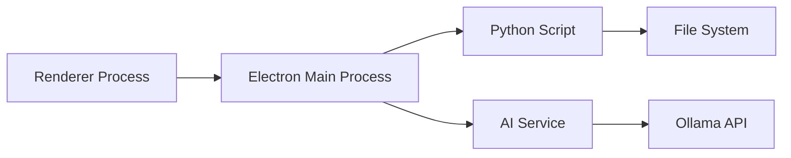

# Developer Guide

This guide covers the technical architecture, development setup, and contribution guidelines for the macOS Cache Cleaner project.

## Table of Contents

1. [Architecture Overview](#architecture-overview)
2. [Development Setup](#development-setup)
3. [Project Structure](#project-structure)
4. [Core Components](#core-components)
5. [Building & Testing](#building--testing)
6. [Contributing](#contributing)
7. [API Integration](#api-integration)
8. [Creating Plugins](#creating-plugins)

## Architecture Overview

### Technology Stack

```
┌─────────────────────────────────────────────────┐
│                 Desktop App                      │
│  Electron + HTML/CSS/JS + Chart.js             │
├─────────────────────────────────────────────────┤
│                AI Assistant                      │
│      Ollama + Local LLM (Mistral)              │
├─────────────────────────────────────────────────┤
│              Core Cleaning Engine                │
│           Python 3.6+ (cache_cleaner.py)        │
├─────────────────────────────────────────────────┤
│                   macOS APIs                     │
│        File System + System Commands            │
└─────────────────────────────────────────────────┘
```

### Component Communication



## Development Setup

### Prerequisites

1. **macOS Development Environment**:
   ```bash
   # Install Xcode Command Line Tools
   xcode-select --install
   
   # Install Homebrew
   /bin/bash -c "$(curl -fsSL https://raw.githubusercontent.com/Homebrew/install/HEAD/install.sh)"
   ```

2. **Node.js & npm**:
   ```bash
   brew install node
   ```

3. **Python 3**:
   ```bash
   brew install python@3.11
   ```

4. **Ollama (for AI features)**:
   ```bash
   curl -fsSL https://ollama.ai/install.sh | sh
   ```

### Setting Up the Development Environment

```bash
# Clone the repository
git clone https://github.com/ttracx/macos-cache-cleaner.git
cd macos-cache-cleaner

# Set up Python environment
python3 -m venv venv
source venv/bin/activate
pip install -r requirements.txt

# Set up Electron app
cd electron-app
npm install

# Install AI model
./setup-ollama.sh
```

### Development Workflow

1. **Run in development mode**:
   ```bash
   cd electron-app
   npm start
   ```

2. **Enable DevTools**:
   ```bash
   export NODE_ENV=development
   npm start
   ```

3. **Hot reload** (manual):
   - Cmd+R in the Electron window
   - Or restart the app

## Project Structure

```
macos-cache-cleaner/
├── cache_cleaner.py          # Core cleaning logic
├── cache_cleaner_gui.py      # Legacy Tkinter GUI
├── electron-app/             # Modern desktop app
│   ├── main.js              # Electron main process
│   ├── renderer.js          # UI logic
│   ├── preload.js           # Secure bridge
│   ├── ai-service.js        # AI integration
│   ├── index.html           # App UI
│   ├── styles.css           # Styling
│   └── assets/              # Icons, resources
├── docs/                     # Documentation
├── tests/                    # Test suites
└── scripts/                  # Utility scripts
```

### Key Files

| File | Purpose |
|------|---------|
| `cache_cleaner.py` | Core cleaning engine with all logic |
| `main.js` | Electron main process, handles system calls |
| `renderer.js` | UI interactions and state management |
| `ai-service.js` | Ollama integration and AI features |
| `preload.js` | Secure IPC communication |

## Core Components

### 1. Cache Cleaner Engine (`cache_cleaner.py`)

```python
class MacOSCacheCleaner:
    def __init__(self, dry_run=False, verbose=False):
        self.dry_run = dry_run
        self.verbose = verbose
        self.total_freed = 0
        self.home_dir = Path.home()
        self.cache_dirs = [...]  # Predefined cache locations
        self.exclude_dirs = {...}  # Protected directories
```

**Key Methods**:
- `clean_directory()`: Safely cleans a directory
- `is_safe_to_delete()`: Validates path safety
- `get_dir_size()`: Calculates directory size
- `clean_*()`: Specific cleaning methods

**Adding New Cache Types**:
```python
# Add to cache_dirs list
self.cache_dirs.append(Path.home() / "Library/NewCache")

# Or create specific method
def clean_new_cache(self):
    """Clean newly identified cache type"""
    cache_path = self.home_dir / "Library/NewCache"
    if cache_path.exists():
        freed = self.clean_directory(cache_path)
        self.total_freed += freed
```

### 2. Electron Main Process (`main.js`)

**IPC Handlers**:
```javascript
// Add new IPC handler
ipcMain.handle('new-feature', async (event, args) => {
    try {
        // Implementation
        return { success: true, data: result };
    } catch (error) {
        return { success: false, error: error.message };
    }
});
```

**Python Script Execution**:
```javascript
const { spawn } = require('child_process');

function executePython(script, args) {
    return new Promise((resolve, reject) => {
        const process = spawn('python3', [script, ...args]);
        // Handle stdout, stderr, and exit
    });
}
```

### 3. AI Service (`ai-service.js`)

**Adding New AI Features**:
```javascript
async function newAIFeature(input) {
    const prompt = `Specialized prompt for ${input}`;
    return this.generateResponse(prompt, context);
}
```

**Custom System Instructions**:
```javascript
this.systemPrompt = `
    You are an AI assistant specialized in:
    1. New specialized area
    2. Additional expertise
    ...
`;
```

### 4. UI Components (`renderer.js`)

**Adding UI Features**:
```javascript
// Add to DOM elements
const elements = {
    newFeature: document.getElementById('newFeature'),
    // ...
};

// Add event listener
elements.newFeature.addEventListener('click', handleNewFeature);

// Implement handler
async function handleNewFeature() {
    const result = await window.electronAPI.newFeature();
    // Update UI
}
```

## Building & Testing

### Running Tests

```bash
# Run Python tests
python -m pytest tests/

# Run JavaScript tests
cd electron-app
npm test

# Run linting
npm run lint
```

### Building for Production

```bash
# Build Electron app
cd electron-app
npm run build

# Create DMG
npm run dist
```

### Code Quality

**Python Style Guide**:
- Follow PEP 8
- Use type hints where appropriate
- Document all public methods

**JavaScript Style Guide**:
- Use ES6+ features
- Async/await over callbacks
- Consistent error handling

### Testing Checklist

- [ ] Dry run mode works correctly
- [ ] All cache types clean properly
- [ ] Safety checks prevent critical deletions
- [ ] UI updates reflect operations
- [ ] AI features handle offline gracefully
- [ ] Cross-platform compatibility (Intel/ARM)

## Contributing

### Getting Started

1. Fork the repository
2. Create a feature branch: `git checkout -b feature-name`
3. Make your changes
4. Run tests
5. Submit a pull request

### Contribution Guidelines

**Code Standards**:
- Clear variable/function names
- Comprehensive comments
- Error handling for all operations
- Logging for debugging

**Commit Messages**:
```
type: brief description

Longer explanation if needed
- Bullet points for changes
- Reference issues: Fixes #123
```

Types: `feat`, `fix`, `docs`, `style`, `refactor`, `test`, `chore`

**Pull Request Template**:
```markdown
## Description
Brief description of changes

## Type of Change
- [ ] Bug fix
- [ ] New feature
- [ ] Documentation update

## Testing
- [ ] Tested on Apple Silicon
- [ ] Tested on Intel Mac
- [ ] Dry run mode verified

## Screenshots (if applicable)
```

## API Integration

### Creating a Programmatic Interface

```python
from cache_cleaner import MacOSCacheCleaner

# Use as a library
cleaner = MacOSCacheCleaner(dry_run=True, verbose=True)
freed_space = cleaner.run()
print(f"Would free: {freed_space} bytes")
```

### REST API Wrapper (Example)

```python
from flask import Flask, jsonify
from cache_cleaner import MacOSCacheCleaner

app = Flask(__name__)

@app.route('/api/analyze')
def analyze():
    cleaner = MacOSCacheCleaner(dry_run=True)
    # Return analysis results
    return jsonify({
        'potential_space': cleaner.analyze(),
        'cache_locations': cleaner.get_cache_info()
    })

@app.route('/api/clean', methods=['POST'])
def clean():
    # Implementation with proper auth
    pass
```

### Node.js Module

```javascript
// cache-cleaner-node.js
const { spawn } = require('child_process');

class CacheCleaner {
    constructor(options = {}) {
        this.options = options;
    }
    
    async analyze() {
        return this.execute(['--dry-run', '--verbose']);
    }
    
    async clean(options) {
        const args = this.buildArgs(options);
        return this.execute(args);
    }
    
    execute(args) {
        // Spawn Python process and return results
    }
}

module.exports = CacheCleaner;
```

## Creating Plugins

### Plugin Structure

```python
# plugins/custom_cleaner.py
from cache_cleaner import CleanerPlugin

class CustomCleaner(CleanerPlugin):
    """Custom cache cleaner plugin"""
    
    def __init__(self):
        super().__init__()
        self.name = "Custom Cleaner"
        self.description = "Cleans custom application caches"
    
    def get_cache_locations(self):
        """Return list of cache locations"""
        return [
            Path.home() / "Library/Application Support/CustomApp/Cache",
            Path("/tmp/customapp-*")
        ]
    
    def clean(self, dry_run=False):
        """Perform cleaning operation"""
        total_freed = 0
        for location in self.get_cache_locations():
            freed = self.clean_location(location, dry_run)
            total_freed += freed
        return total_freed
    
    def estimate_size(self):
        """Estimate space that can be freed"""
        return sum(self.get_dir_size(loc) 
                  for loc in self.get_cache_locations())
```

### Registering Plugins

```python
# In cache_cleaner.py
def load_plugins():
    """Load all available plugins"""
    plugin_dir = Path(__file__).parent / "plugins"
    for plugin_file in plugin_dir.glob("*.py"):
        # Dynamic import and registration
        pass
```

### UI Integration for Plugins

```javascript
// In renderer.js
async function loadPlugins() {
    const plugins = await window.electronAPI.getPlugins();
    plugins.forEach(plugin => {
        createPluginUI(plugin);
    });
}

function createPluginUI(plugin) {
    const container = document.getElementById('plugins');
    const pluginElement = document.createElement('div');
    pluginElement.className = 'plugin-item';
    pluginElement.innerHTML = `
        <h3>${plugin.name}</h3>
        <p>${plugin.description}</p>
        <button onclick="runPlugin('${plugin.id}')">Clean</button>
    `;
    container.appendChild(pluginElement);
}
```

## Advanced Topics

### Performance Optimization

1. **Parallel Processing**:
```python
from concurrent.futures import ThreadPoolExecutor

def clean_parallel(self, directories):
    with ThreadPoolExecutor(max_workers=4) as executor:
        futures = [executor.submit(self.clean_directory, d) 
                  for d in directories]
        results = [f.result() for f in futures]
    return sum(results)
```

2. **Progress Reporting**:
```python
def clean_with_progress(self, callback):
    total_dirs = len(self.cache_dirs)
    for i, cache_dir in enumerate(self.cache_dirs):
        freed = self.clean_directory(cache_dir)
        progress = (i + 1) / total_dirs * 100
        callback(progress, freed)
```

### Security Considerations

1. **Path Traversal Protection**:
```python
def validate_path(self, path):
    # Ensure path is within expected boundaries
    resolved = path.resolve()
    if not str(resolved).startswith(str(self.home_dir)):
        raise SecurityError("Path outside home directory")
```

2. **Privilege Escalation**:
```python
def require_admin(func):
    """Decorator for admin-only operations"""
    def wrapper(*args, **kwargs):
        if os.geteuid() != 0:
            raise PermissionError("Admin privileges required")
        return func(*args, **kwargs)
    return wrapper
```

### Debugging

1. **Enable Debug Logging**:
```python
import logging

logging.basicConfig(
    level=logging.DEBUG,
    format='%(asctime)s - %(name)s - %(levelname)s - %(message)s',
    filename='cache_cleaner.log'
)
```

2. **Electron DevTools**:
```javascript
// In main.js
if (process.env.NODE_ENV === 'development') {
    mainWindow.webContents.openDevTools();
}
```

3. **AI Service Debugging**:
```javascript
// In ai-service.js
this.debug = process.env.AI_DEBUG === 'true';

if (this.debug) {
    console.log('AI Request:', prompt);
    console.log('AI Response:', response);
}
```

## Resources

- [Electron Documentation](https://www.electronjs.org/docs)
- [Ollama API Reference](https://github.com/jmorganca/ollama/blob/main/docs/api.md)
- [macOS File System Reference](https://developer.apple.com/library/archive/documentation/FileManagement/Conceptual/FileSystemProgrammingGuide/)
- [Python pathlib Documentation](https://docs.python.org/3/library/pathlib.html)

## Support

For development questions:
- Create an issue with the `development` label
- Join our Discord server (coming soon)
- Email: mail@tommytracx.com